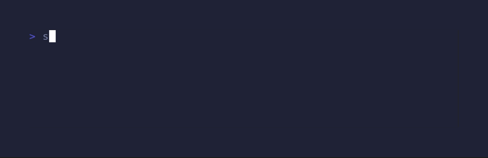
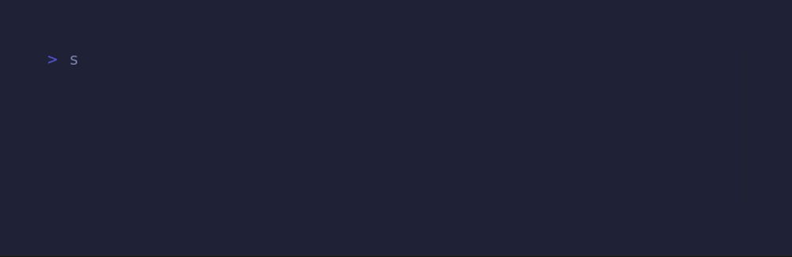

<div align="center">
<pre>
╔═╗╔═╗╔╦╗╦ ╦╔═╗
╚═╗║╣  ║ ║ ║╠═╝
╚═╝╚═╝ ╩ ╚═╝╩  
Cross-platform file synchronizer
</pre>
</div>

### Version 0.1.0-pre-alpha.1
> Still in early development and not stable, please be careful if you plan to 
try it.

## **About**
This program allows you to automatically update your development ecosystem 
(file structure hierarchy, git repo, dotfiles, etc) from or to this repository, 
making your tools and directories deployment faster while switching environments 
or computers.</br>

Only available on **Linux** and **Windows**, but **BSD** and **Mac** will soon 
be available.

### **⚠️ Important**
This repository currently uses **my configuration**. If you want this to work 
on your side, you should **fork** or **copy** to configure it the way you want 
it to work. 

### ***Dependency***
- All plaftorms: **Python 3**
- Windows: **Powershell 7**

## **Download**
<details>
  <summary><strong><em>Linux</em></strong></summary>

  ```
  bash -c "cd $HOME && git clone git@github.com:algadea/.setup.git \
  && cd .setup && python initialization.py"
  ```
</details>

<details>
  <summary><strong><em>Windows</em></strong></summary>

  ```
  Invoke-Expression 'Set-Location $HOME;
  git clone git@github.com:algadea/.setup.git;
  Set-Location .\.setup\;
  python initialization.py'
  ```
</details>

<details>
  <summary><strong><em>BSD</em></strong></summary>

  `Work in progress...`
</details>

<details>
  <summary><strong><em>Mac</em></strong></summary>

  `Work in progress...`
</details>

## Functionality

### ***Dotfiles***
This is the complete list of dotfiles and config that are used in this script.
  - Alias
  - Directory
  - Editor: **Vim | Neovim | Vscode**
  - Font
  - Git
  - Shell: **Bash | Fish | Powershell | Zsh**
  - Terminal Emulator: **Alacritty | Gnome-terminal | Terminator | Windows-terminal**
  - Terminal Multiplexer: **Tmux**
  - Terminal Prompt: **Starship**

### ***Directory structure***
  Precise all the repo that you want to setup in your HOME in the **dir.conf** 
  file stored in **dotfiles/directory**.
  - this dir.conf
  ```
  $HOME/Dev/42/42API: git@github.com:algadea/42API.git
  $HOME/Dev/42/Common-Core: git@github.com:algadea/Common-core.git
  $HOME/Dev/Github/algadea: git@github.com:algadea/algadea.git
  $HOME/Dev/Project/AdventOfCode: git@github.com:algadea/AdventOfCode.git
  $HOME/Dev/Project/Exercism: git@github.com:algadea/Exercism.git
  $HOME/Dev/Project/Portfolio: git@github.com:algadea/Portfolio.git
  $HOME/Dev/Template: git@github.com:algadea/Template.git
  ```
  - should give
<pre>
HOME/
└── Dev/
    ├── 42/
    │   ├── 42API/
    │   └── Common-core/
    ├── Github/
    │   └── algadea
    ├── Project/
    │   ├── AdventOfCode/
    │   ├── Exercism/
    │   └── Portfolio/
    └── Template/
</pre>

## **Usage**
### ***Install***


⚠️ Performing installation while erase all local dotfiles used by this script.
All local files will be stored into a backup directory to avoid any future 
issues after installation process.
- install the script binary into the **$HOME/.local/bin** directory
- install all the doftiles and config locally
- git clone all repositories specified in dir.conf locally

### ***Pull***


- update all local dotfiles by checking if there are differences with the ones
stored into the setup directory 
- update all local git repositoriesstored in the dir.conf file by using 
`git pull` in their respective directory

### ***Push***


- if possible, update all remote repo from directories specified in the dir.conf
 file by performing:<br>
 &nbsp;&nbsp;`git add . && git commit -m "Update files" && git push origin`<br>
- update all dotfiles and config stored into the setup directory then push 
everything to the remote directory of this script

### ***Utils***
These are futures options that will give more functionalities to this script
- **setup --set-dir**<br>
`Work in progress...`
- **setup --unset-dir**<br>
`Work in progress...`
- **setup --set-font**<br>
`Work in progress...`
- **setup --unset-font**<br>
`Work in progress...`